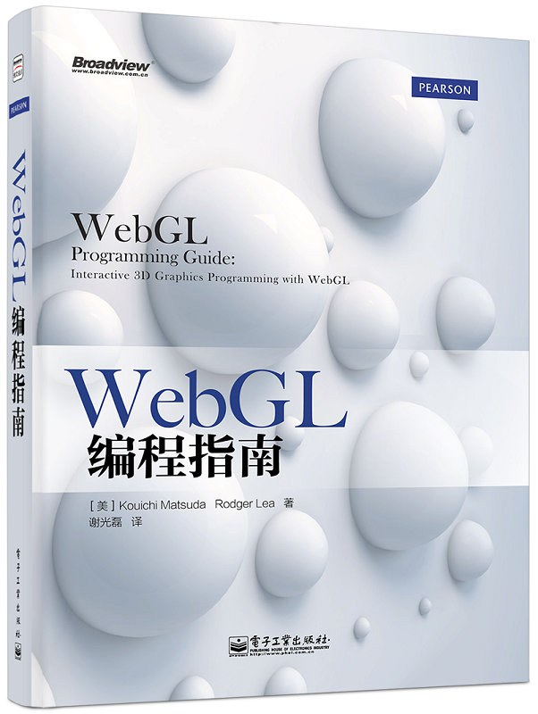

<!-- more -->

- [WebGL简介](https://shimo.im/docs/5rk9d7ObbxHGwYqx)
- [绘制一个点](https://shimo.im/docs/XKq4Mgb9Zour74kN)
- [绘制和变换三角形](https://shimo.im/docs/RKAWVOPQoQSE7Bk8)
- [高级变换和动画基础](https://shimo.im/docs/2wAlXy7EnMh7m4AP)
- [颜色与纹理](https://shimo.im/docs/ZzkLV5yQK1s9WV3Q)
- [进入三维世界](https://shimo.im/docs/5rk9dlz1YDh5xKqx)
- [光照](https://shimo.im/docs/R13j8K4wyaued5k5)

