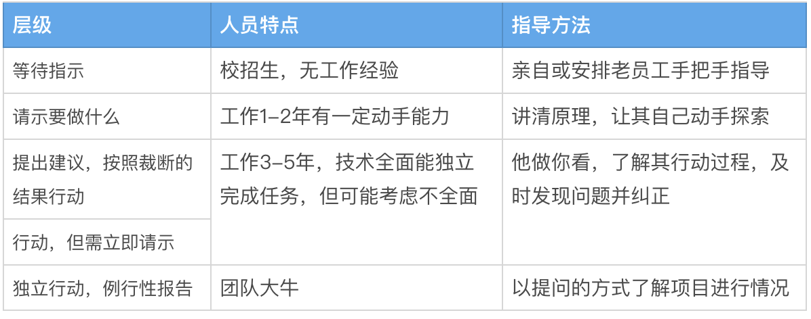

最近花了几天的时间读了这本关于时间管理书，书名很有意思，作者通过生动的例子解释了为什么管理者每天没时间，但是下属却没事做的现象。这本书是从管理的角度出发分析和管理“猴子”，对于员工来说，同样可以学到我们要如何喂养好自己的猴子，并且避免不经意间让别人的猴子跳到自己的背上。
<!-- more -->
# 猴子是怎么产生的
我们首先要了解比喻中的猴子不是值具体的项目、任务、问题，而单纯就是说交流后的下一个行动。那么猴子是从何而来呢？
想想这样一个场景:
当下属去向领导请教一个工作中遇到的难题，但是领导可能正在处理其他的问题没时间马上进行解答，或者这个问题他之前也没有相关的经验，需要时候去调研了解下才能给出问题的答案，这是可能给到下属的答复就是“给我些时间，晚些答复你”， “让我先想一下，再给你解答”。
这时我们会发现一个问题，猴子不经意间爬到了领导的身上，管理的关系倒过来了！过了很久如果管理者还没处理下属的问题，下属可能会不好意思的来问管理者：“这个问题有什么结果了吗”这期间下属可能由于没有得到解答工作一直处于停滞的状态。管理者和下属往往是一对多的关系，如果长此以往，管理者身上可能爬满了猴子。

# 让猴子留在下属身上
那么如何避免猴子爬到自己身上呢？相同的场景我们把答复改一下：
“我下午有时间，到时候你那个时候我们再来聊一下这个问题”或者“这个问题，我觉得可以去通过xxx的方式寻找下答案，你可以下去尝试下，明天这个时间带着你的结果我们再来聊一下”。猴子仍然在下属的身上！

有时候管理者可能会有这样的担心，如果总是这样做，会不会被认为是在推脱责任，被下属认为没有能力，或许会被这样认为。但是我们需要思考这样一个问题，管理者的贡献来自于他们的判断力与影响力，而非他们个人投入的时间长短与埋头苦干的程度。你的时间被分成四部分：老板占用的时间、组织占用的时间、你自己的时间、下属占用的时间。管理者需要在完成老板和组织的任务保证有充足的时间去思考更高层次的问题，做更有创造性的工作，而不是被众多的猴子爬满全身。

# 喂养猴子六大原则
作为管理者在帮助下属明确谁是猴子主人的同时，也要成为专业的训猴师。这里安肯提出了喂养猴子的六大规则。

> 规则1：要么喂养它们，要么射杀它们，千万不要让它们被活活饿死。
规则二：不要让猴子过量 

万物皆可二八定律，将有限的精力投入到重要的事情，为猴子排列优先级，明确时间共同喂养猴子，不要你的精力过于分散。每天丢给下属过多的猴子，你的下属会尊重你所要检查的部分，而非你期待的部分。

>规则三：喂养猴子的责任必须落在下属身上。不要越级分配任务

与下属约定好时间，按照喂食进度表上的时间和地点喂养猴子是下属的责任，主管不必再沿途追逐即将饿死的猴子，胡乱地喂食。组织实务上的基本原则便是，资深管理者不该在未告知直属下属之前，便绕过下属直接对后者的下属宣布指示，除了攸关生死的情况。这项原则一旦遭到破坏，便会导致所谓的越级监督，混淆了任务的优先次序，让接到指示的下属费力不讨好。

>规则四：毫无进展不能作为重新安排喂食时间的借口

即便是没有任何进展，也要按照约定的喂养时间喂养猴子，可以了解毫无进展的原因，以及做出新的规划，缺少进展和进展对管理者来说同等重要。

>规则五：避免遭到误解

无论何时，应尽可能面对面地喂养猴子，或者使用电话，不要使用邮件、微信、报告等。让下属当面念报告，管理者提问，这样节省管理者时间。如果有些事情只有你有权限做（比如约见副总裁），下属要在现场一起。

>规则六：展开即时的对话

长篇大论的报告一定要附上一份简短的摘要，以说明里面的内容。这份简短的摘要可以让你们展开对话，让你很快了解到报告内容，以便展开即时的对话。

# 安肯自由量表

# 总结
本书作者威廉·安肯用猴子的比喻讲述了管理者是因何受困于管理倒置，并提出了喂养猴子的六大原则，浅显易懂发人深醒。相反从员工的角度出发，也可以通过安肯自由量表定位自身所处的等级并不断向更高的等级提升。