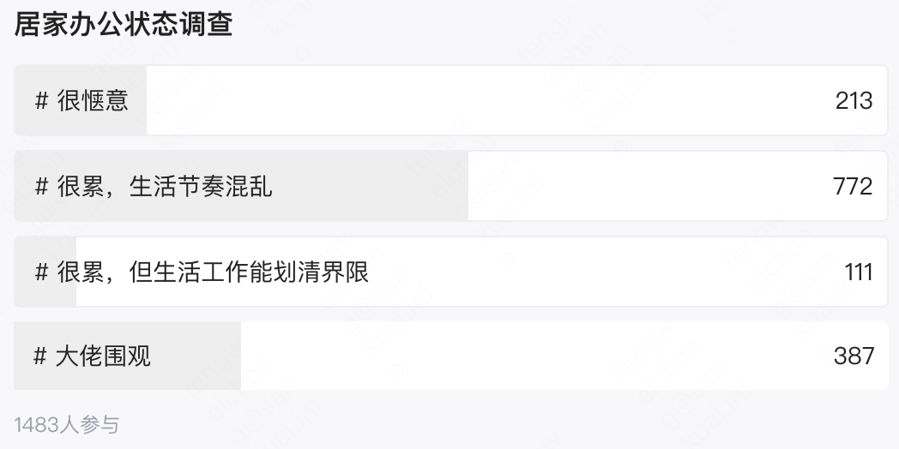

五月初，随着北京的疫情的逐渐恶化，位于朝阳区的公司响应北京市疫情防控的要求，通知员工居家办公，到现在已经一个多月了。对于第一次长时间可以居家办公的我来说，起初是充满主观期待的，但是随着居家时间的延长，慢慢的也就对这样的办公方式也有了一些客观的感受。
<!-- more -->

## 个人感受
好处 ：
- 工作时间更加灵活，可以根据个人情况进行浮动调整
- 免去了一些不必要的沟通，远程拉会更加直接，直奔主题，时间更短
-   每天节省了至少2个小时的通勤时间，不会有下班到家的疲惫感
-   个人时间比较充裕，晚上有时间运动

坏处：
-   办公环境（主要是椅子😂）不够舒服，且容易收到干扰🐱，效率较低
-   失眠、睡得晚，起得也晚，吃饭、生活不规律
-   之前会利用通勤时间听一些播客和电子书，居家后这些软件基本不会打开了

总体来说，居家办公期间体验还是很不错的，在沟通质量、需求完成度和Coding产出效率方面能够有一定保证，且不用每天八个小时都坐在电脑前，可以享受到灵活的工作时间带来生活的便利。

## 如何更好的居家办公
前段时间在脉脉上看到这样一个关于【居家办公状态】的投票，按照脉脉上人均年薪百万的氛围，结果不见得客观。但是投票的内容主要体现在居家办公期间能否将工作和生活进行很好的划分上。

居家办公感觉很累，生活节奏混乱我想并不是因为居家办公后你的工作量增加了，而可能是工作效率变低了。下面这些方法也是我一直在尝试做和改进的：

-   找一个固定的角落放上电脑，水杯，充电器，工作前可以冲一杯咖啡。总之可以让开始工作变的更有仪式感
-   制定每一天明确的Todo List，既包括工作上也包括生活上的
-   做好工作进度的反馈，日报在居家办公场景下确实是一个好东西
-   工作时把固定时长的思维调整为固定任务，每天合理的分割工作量，保证效率，完成任务可以提前下班
-   强迫自己早睡，规律饮食，提前点好外卖，或准备好做起来不用太耗时的食材

## 结尾
居家办公不仅仅是对员工主动性考验，同时也是对公司管理制度考验。公司不应该以压榨员工的办公时长作为目的，而是建立高效的沟通机制、由下至上及时的进度反馈途径、自驱动的工作氛围（[Y理论](https://baike.baidu.com/item/X%E2%80%94Y%E7%90%86%E8%AE%BA)）。个人是不能接受公司因居家办公而降薪的做法，这会让每个人有充分的理由因降薪做更少的事情。希望更多的公司和个人借着这个疫情这个契机可以摸索出一套适合自身的居家办公机制，让居家办公成为一种常态化的工作模式。