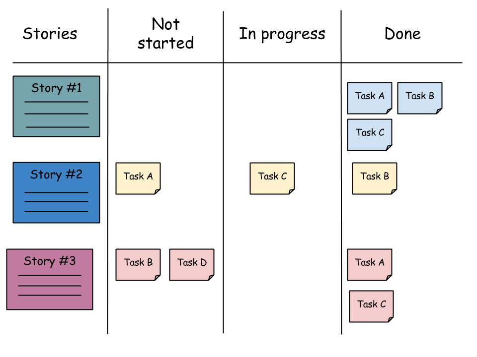

第一次完整接触到敏捷开发还是在一次作为技术支持协助一个客户团队将本公司平台在应用落地的过程中。研发团队的规模在30人左右，团队也是刚刚在以一位敏捷教练的带领下开始实施敏捷开发。在为期一个月的技术支持中见证了研发团队由最开始的有些抵触，到最后可以高效的完成每个迭代的内容。最终的的成果也是在其公司内部获得了很不错的成绩。

<!-- more -->

## 什么是敏捷开发
> 敏捷开发以用户的需求进化为核心，采用	迭代	、循序渐进的方法进行软件开发。—百度百科

敏捷开发（Agile）是一种是一种以迭代为核心的开发模式，通过将长周期的开发任务按照1-4周的粒度拆解成多个小版本的方式进行持续迭代，让产品尽早面向客户，以最低的成本获取反馈，验证可行性，降低产品失败的风险。“敏捷”一词由[《敏捷软件开发宣言》](https://blog.pingcode.com/min-jie-xuan-yan-ji-xiang-guan-jie-du/?utm_source=zhihu&utm_medium=answer-xiao-1&utm_campaign=%E4%BB%80%E4%B9%88%E6%98%AF%E6%95%8F%E6%8D%B7%EF%BC%9F&utm_content=961162218&utm_term=30945320)中开始推广，敏捷软件开发宣言定义了相关的价值和原则。在互联网产品爆发的时代，需要尽快的推出MVP版本的应用验证需求，占领市场。在这种小步快跑快递迭代节奏和不断变化的需求环境中敏捷开发发挥了很大的价值。

## 瀑布、增量、敏捷开发模式
- 瀑布模式
一种预测型的开发模式，需求的定义十分明确，按照规范的需求分析-方案设计-代码开发-测试-运维流程，过程中不会有较大的变更，最终产生一个完善的应用版本。
- 增量开发
增量开发模式，更像一种阶段性的里程碑模式，每个阶段开发指定的模块，每个阶段可以看到对应的成果，但是不能算是一个完整的产品。
- 敏捷开发
敏捷开发允许在短时间内提供一个不完美但是具备核心诉求的版本，在后面的迭代中根据用户的反馈不断完善，最终形成一个完善的产品。

## 敏捷开发流程之Scrum
Scrum是一个非常常见的敏捷实施框架，其核心内容是3个角色，5个会议

### 3个角色
与传统的项目管理相比，Scrum中没有项目经理的角色取而代之的是产品所有者（Product Owner）, 敏捷教练（Scrum Master），开发团队(Team)。
- 产品所有者
负责收集产品需求并已用户故事的形式记录在backlogs，每个迭代梳理需要处理的用户故事并排列优先级
- 敏捷教练
敏捷教练并不是项目经理，敏捷教练并不会参与到项目的生产内容中，不会去分配任务和考核人员。敏捷教练的职责是保证项目团队严格按照敏捷的流程，知道产品所有者对用户故事进行拆解，并合理规划每个迭代的范围。
- 开发团队
开发团队按照技能不同一般包含前端、后端、测试、UI/UE等，且每个人对产品的价值有共同的认知，保证全职的时间投入到每个版本迭代。

### 5个会议
|会议名称	|会议内容	|参会人员	|时间节点|
|  ----  | ----  |----  |----  |
|待办事项整理会议|	明确下个迭代的用户故事，解答参会人员对用户故事的疑惑，排列用户故事优先级。|	产品所有者 敏捷教练 团队关键成员	|迭代计划会议前2-3天|
|迭代计划会议	|产品所有者给大家讲解用户故事内容，解答疑惑，敏捷教练带领开发团队通过敏捷卡片的形式逐一对用户故事进行点数评估，直到迭代周期内工作量饱和|	全体项目成员|	迭代开始前|
|每日站会	|通过看板的形式，开发团队成员相互沟通进度，发言内容包括：昨天做了什么？今天计划做什么？是否遇到问题需要他人支持？|	全体项目成员	|每天|
|评审会|	小组向产品负责人展示迭代工作结果，产品负责人给出评价和反馈。以用户故事是否能成功交付来评价任务完成情况。整个团队都需要参加，可能还有客户。	|全体项目成员 客户代表	|迭代测试通过|
|反思会|	总结迭代内哪些事情做的好，哪些点有待提升|	全体项目成员|	迭代完成后|

## 敏捷开发模式优缺点
### 优点
- 以最低的成本最快速交付MVP版本
- 小步快跑快速迭代，更快、更好、更容易快速响应用户需求和市场变化

### 缺点和不足
- 缺乏必要的文档进行信息记录
- 不适用于小型的开发项目
- 前期敏捷实施过程中需要专业的敏捷教练进行指导
- 与其他的模式相比，敏捷开发的成本较高

## 敏捷的术与道
“道”，可理解为真理、规律、本原；“术”，即技术，方法、工具。敏捷中的"术"指的是，实施敏捷中应用的框架，行为或工具。术，因团队而异，但是敏捷之道确实我们在日常的工作中无论是否使用敏捷开发的模式都可以参考使用。
在2001年，17位敏捷方法论的拥护者和倡议者聚集在犹他州的雪鸟滑雪场，起草了一份陈述敏捷组织原则的文件。这就是后来广为人们所熟知的敏捷宣言4大核心价值和12条遵循的原则。

> 经常地交付可工作的软件，相隔几星期或一两个月，倾向于采取较短的周期。
以简洁为本，它是极力减少不必要工作量的艺术。

可以尝试将产品提的需求拆解成可以独立发布的多个小版本分别进行开发和上线，将复杂问题拆解开来逐个击破，避免一次性交付可能造成的整体性延期风险。

> 业务人员和开发人员必须相互合作，项目中的每一天都不例外。

主动将开发过程中的阶段性成果与产品PM进行对齐，确保方向正确。

> 不论团队内外，传递信息效果最好效率也最高的方式是面对面的交谈。

面对面交谈是最高效的沟通方式，单纯的使用文字有可能存在各自的理解偏差，与其在工位上打字，不如直接走过去交流各自的想法。

> 敏捷过程倡导可持续开发。责任人、开发人员和用户要能够共同维持其步调稳定延续。

让团队保持在一个合理可控的研发节奏，尽量避免为了一味的追求快而进行赶工，避免牺牲质量追求数量。

> 激发个体的斗志，以他们为核心搭建项目。提供所需的环境和支援，辅以信任，从而达成目标。

产研的关系不应该是提出任务和完成任务的关系，团队成员需要共同从用户价值的角度出发理解需求，并自发的最完成这一目标充满激情。

## 参考资料

[《如何确定敏捷是否适合你的团队？》](https://blog.worktile.com/scrum-if-agile/?utm_source=zhihu&utm_medium=answer&utm_term=30945320&utm_content=agile&utm_campaign=meiyang&utm_source=zhihu&utm_medium=answer-xiao&utm_campaign=%E4%BB%80%E4%B9%88%E6%98%AF%E6%95%8F%E6%8D%B7%EF%BC%9F&utm_content=961162218&utm_term=30945320)
[《什么是敏捷？》](https://www.zhihu.com/question/30945320?sort=created)
[《敏捷软件开发宣言》](http://agilemanifesto.org/iso/zhchs/manifesto.html)
[《敏捷宣言遵循的原则》](http://agilemanifesto.org/iso/zhchs/principles.html)
