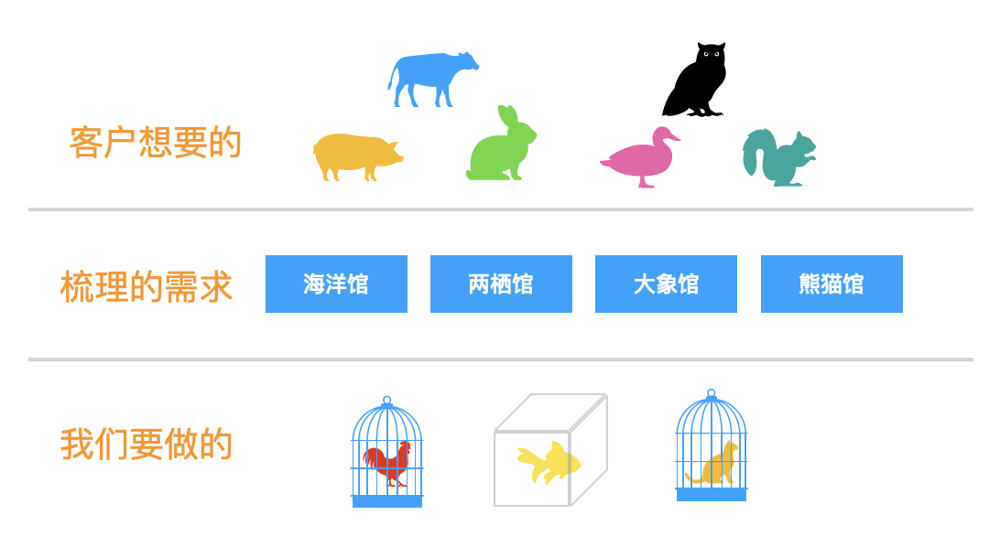

俗话说的好“预则利，不预则废”，良好的计划是项目能否成功的重要因素。项目管理管理本质上就是对项目的范围、时间、成本进行管理，因此项目范围有清晰的界定和管理计划就是其中很关键的一个环节。如果项目范围随心所欲，漫无边界，时间一长会让项目成员失去信心，毫无斗志。一个清晰明确的项目范围，有助于团队成员看到阶段性成果，持续推动项目。

<!-- more -->

## 什么是项目范围

在需求收集阶段，收集到的客户想法往往都是天马星空，天上飞的、地上跑的、水里游的全部都希望看到。经过我们的需求梳理整理出来的需求可能是我们需要建一座动物园，里面有海洋馆、两栖馆、熊猫馆等，但是时间和经费都极其有限，因此第一个版本我们能够提供的可能只需要是几个笼子和鱼缸，里面装上小动物就可以了。通过这个例子主要想表达，用户想的和最终我们要做的在项目中往往不一定等同，最终我们要做的可以满足项目成败关键的内容的才是项目范围。项目范围管理就是确保我们做且只做项目范围内的全部工作。

## 如何定义项目范围
有一个清晰直观的项目范围有助于项目各方对于项目的可交付成果达成共识，工作分解结构（WBS）是用于定义范围的常用方法。

工作分解结构，就是按照一定的项目逻辑将工作逐级进行拆分，直到拆分成一个个不可以再拆分的活动，而且可以100%覆盖所有的内容。每个活动都应该包含对于其内容的详细描述、时间规划和对应的唯一负责人。通过WBS分解结构可以使笼统的项目范围更加清晰，定期更新活动状态也可以让我们更直观的看到项目当前的进展、暴露延期风险。

## 范围发生变化的原因
- 范围蔓延
什么是范围蔓延，好比你只想要在商场买一件羽绒服，逛的时候发现这家店的毛衣也在打折，而你也刚好没有毛衣了，于是你也顺便买了一件，这就是范围蔓延。范围蔓延往往发生在对于项目理解不深刻或者对于活动的定义不明确的时候。
- 镀金
镀金是指，需求里面没有明确的要求的功能，开发者出于炫技、自我表现，擅自添加的内容，这部分可能最终根本不是客户想要的，或者因为这项新功能带来额外的维护成本。

不论是范围蔓延还是镀金，都会对我们的都会对我们的项目基准，时间、范围、成本产生影响，我们在管理的过程中都应该避免发生这两个问题。

## 如何处理变更
在项目实施过程中，出现范围的变化在所难免，我们该怎么去处理这些变化呢？
1、首先客户可能出于需求的调整提出功能的变更
2、拿到变更后我们要先去对于变更的内容进行分析确定其必要性，评估变更对于项目排期是否有影响
3、若分析后变更的内容并不是必须，可以选择将变更归纳到二期的需求中处理，并将结果反馈给提出者
4、若变更内容不影响项目排期，需要将变更内容记录到项目文件中
5、如果变更内容影响到项目排期，则需要交由CCB确定是否变更，通过后再更新项目计划
6、需要注意的是在执行变更之前，需要将变更结果通知到相关方，确保信息同步。

## 总结
良好的范围管理可以让我们避免陷入无尽的忙碌中。